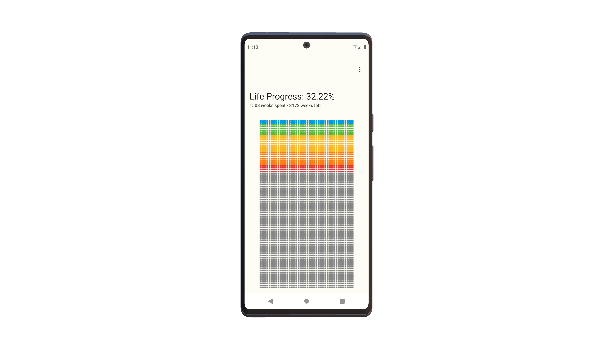
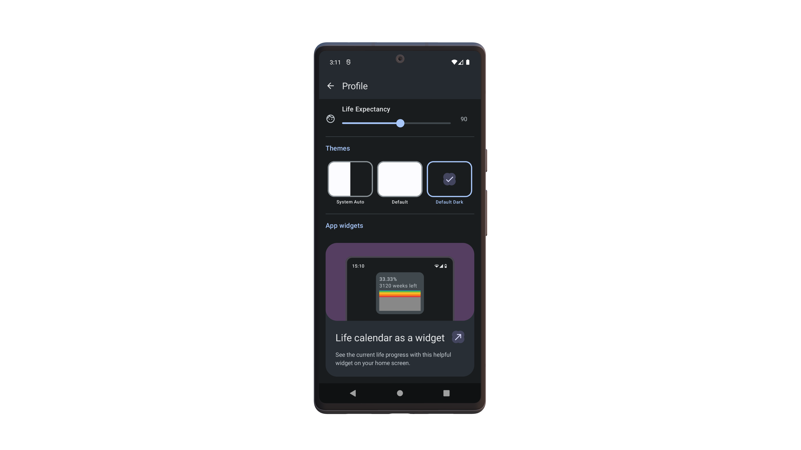
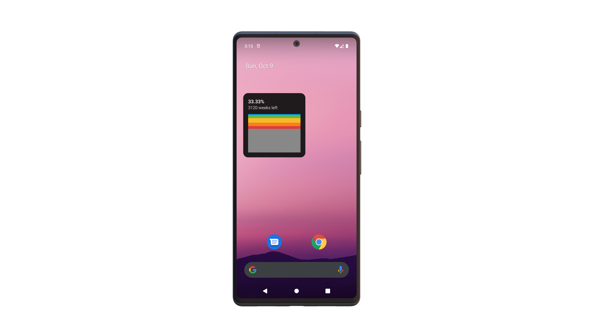

# Life Progress
> Friendly reminder that you're not gonna live forever.

# Download
(https://play.google.com/store/apps/details?id=com.bartozo.lifeprogress)

# How it works
- Each ⬜️ square you see on screen represents a week in your ❤️ life. The first square (the one at the top left) is the week you were born.
- Each row of 52 weeks makes up one year.
- The 🎨 colored squares are the weeks in the past, the gray ones are what you have left.

  

The app also comes with widget created in compose glance so you can see your life progress on your home screen.
about
 

# About the project
- 😎 The project was created in Jetpack Compose. (Say goodbye to XML layouts)
- 🎨 UI was created with Material Design 3 and Material You.
- 💡 Light and Dark mode are supported.
- 📱 The app widget was created in Compose Glance with helpful examples from [Marcel](https://twitter.com/marxallski).
- 👨‍🎨 Creator of the app icon is [akhmadmaulidi](https://twitter.com/akhmadmaulidi) 

# Thanks
- [Tien Pham](https://twitter.com/tienphaw) for the creating iOS app. It inspired me to create an android version.
- [Ken Wheeler](https://twitter.com/ken_wheeler) for the [app idea](https://twitter.com/tienphaw/status/1533797664432615424).
- [Tim Urban](https://twitter.com/waitbutwhy) for introducing us to the concept of the life calendar in [this article](https://waitbutwhy.com/2014/05/life-weeks.html).
